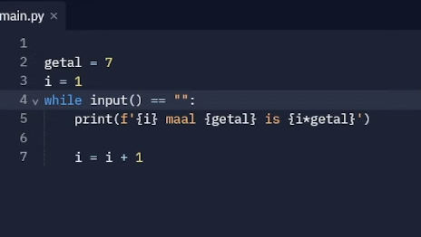
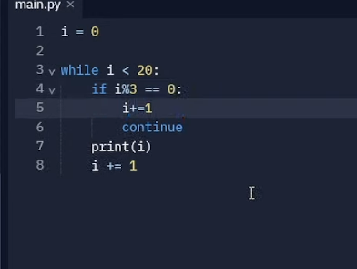

for loop getal in lijst -> getal in de variabele op de index. 
Dan kun je met die waar de gelijk iets doen

lijst = []

max_getal = 0

if getal in lijst:
    if getal > max_getal:
        max_getal = getal
        print(max_getal)

max_getal van te voren op 0 defineren is gevaarlijk, weet je niet wat je hebt of wat het gaat zijn,
maak dan de lijst aan en zet max_getal = lijst[0]

whileloop voor als je niet van te voren weet wat het einde is 

continues while loop
continue zorgt ervoor dat je uit de loop gaat en in dit geval terug naar getal < i

bij een break stop die het hele proces of gaat verder in de code er onder
continue = verder in loop na uitzondering
break = volledig stoppen

continue ga je de verder in de loop