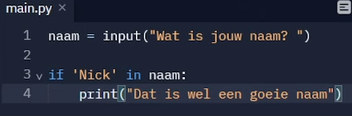
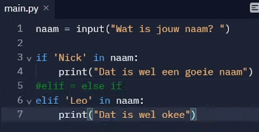
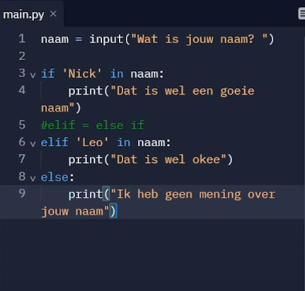

strings kun je vermeningvuldigen

string1 = 'hallo'
string 2 = 'ha' * 4, dit zal 4x ha printen

string formatten -> format strings
i = 3
string4 = F'i maal i is { i * i}'
string5 = f'3/2 = { 3 /2 }'

voorbeeld
string = f'Nick 3x: { "nick"*i}'

#input
input is een functie, dus met() naam = input('wat is jouw naam')
print(f'jouw naam is:{naam}')

casting kun je type naar ander type omzetten
leeftijd = int(input('wat is jouw leeftijd?'))
print(f' jij bent al {leeftijd} x jarig geweest')
of print(f'over 10 jaar)

#logica not, and, or & in
 
NOT zorgt voor inventeren waarden, omwisselen dus
is vooral voor omzetten van boolean bv a = true print not a geeft dan false

AND krijgt twee verschillende dingen mee
a = true
b = true
print (a and b) geeft true

OR
kan printen als het een van de twee is dus of waarde 1 moet voldoen of waarde b

IN
is om te controleren om te kijken of iets in de string of variable zit
dit geeft true of false neer
string = 'mijn naam is jasper'
print('jasper' in string) -> true

# IF ELIF ELSE
else

elif elseIf

