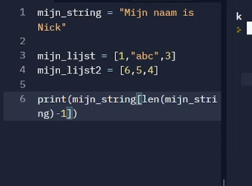

laatste index is -1

Nog even om hier op terug te komen: je kunt ook meerdere characters van een string krijgen door string_naam[begin_positie:een_na_eind_positie] te doen
Bijvoorbeeld:
str = "Dit is een string"
print(str[0 : 3]) -> geeft "Dit"
print(str[4 : 6]) -> geeft "is"
Let wel op de 3 en 6 zijn de indexen die na de laatste waarde staan die je wilt hebben
Index 3 is de spatie na "Dit"
Index 6 is de spatie na "is"

len() om te kijken hoe lang een element is. Dit kan een string/array zijn
#### Geeft het aantal elementen
len(lijst1)
len(string1)
#### Geeft het kleinste element
min(lijst1)
#### Geeft het grootste element
max(lijst1)
#### Geeft de som van de elementen.
sum(lijst1)
sum(['a', 'b', 'c', 'd'])

min max in lijst zonder getallen, lexicografish. Dus dan gaat hij op alfabetische volgorde kijken

lijst = ['a', 'b', 'c', 'd', 'e', 'f']
#### Het element wordt achteraan de lijst toegevoegd
lijst.append('d') # d staat nu ook achter in de lijst
#### Geeft terug hoe vaak het element voorkomt in de
lijst
lijst.count('d') # 2
#### Geeft de index van het eerste element van het
inputargument
lijst.index('d') # 3
lijst.insert(2, 'g') # Stopt g op positie 2